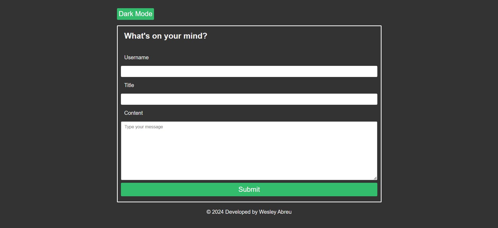

<h1>Personal Blog</h1>

<h2>Description</h2>

This personal blog features an input form where users can input their username, title, and content for a new blog post. Upon submission, the entered data is saved to the local storage of the user's browser. This allows for the creation of a post that is persisted even after the browser is closed or refreshed.

Once a post is saved, it is dynamically displayed on the blog window, allowing users to immediately see their newly created content alongside existing posts. This seamless integration of input form and post display enhances the user experience, enabling quick and intuitive content creation and viewing.

In addition, the blog includes a convenient toggle button for switching between dark and light modes, providing users with customizable viewing options to suit their preferences and enhance readability in different environments.

<h2>Technologies Used</h2>

HTML

CSS

JavaScript

<h2>How to Use</h2>

1. To create a new blog post, enter your username, title, and content in the designated input fields on the blog's main page.
2. After entering the required information, click on the "Submit" button. This action will save your post and bring you to the page displaying your newly created post.
3. If you wish to add more posts, simply tap on the "Add Post" button.
4. To toggle between dark and light modes for improved readability, click on the "Dark Mode" button provided on the interface. This feature allows you to customize the appearance of the blog according to your preference and lighting conditions.

<h2>Screenshots</h2>

<h2>Deployment</h2>

The application is deployed at https://wabreu738.github.io/personal-blog/
